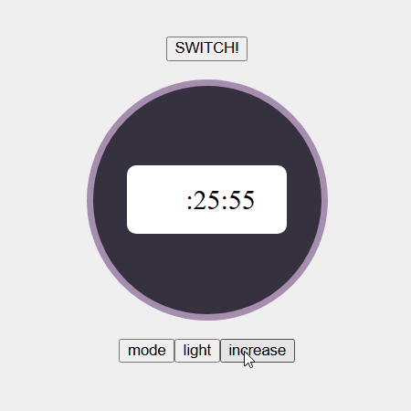
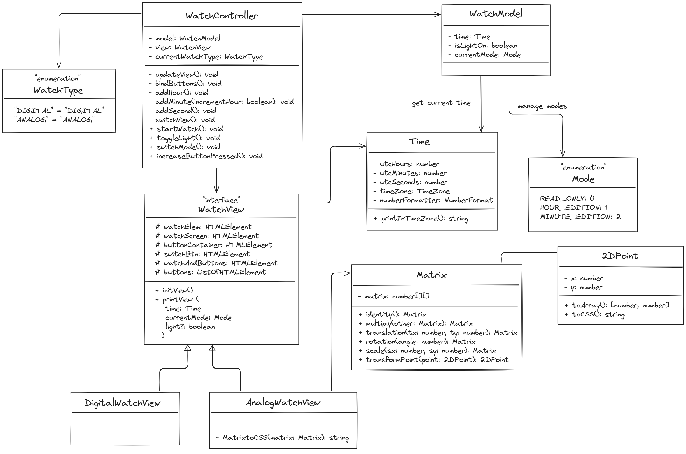

# GE Healthcare Technical Test

## Watch App

MVC web application simulating a watch with some functionalities. [_See details in instructions.md_](./instructions.md)

### Part A


### Part C

Skipped directly to the part C, most important part of the technical test for my profile. :)




## Launch

```javascript
npm install
npm run start
```
